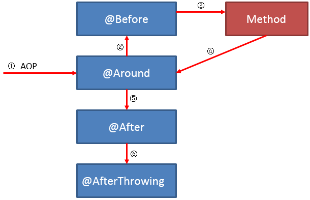

# AOP

AOP为Aspect Oriented Programming的缩写，意为：面向切面编程，通过预编译方式和运行期动态代理实现程序功能的统一维护的一种技术.AOP是OOP的延续，是软件开发中的一个热点，也是Spring框架中的一个重要内容，是函数式编程的一种衍生范型。利用AOP可以对业务逻辑的各个部分进行隔离，从而使得业务逻辑各部分之间的耦合度降低，提高程序的可重用性，同时提高了开发的效率。


AOP常用注解：

> @Aspect:作用是把当前类标识为一个切面供容器读取
>
> @Pointcut：Pointcut是植入Advice的触发条件。每个Pointcut的定义包括2部分，一是表达式，二是方法签名。方法签名必须是 public及void型。可以将Pointcut中的方法看作是一个被Advice引用的助记符，因为表达式不直观，因此我们可以通过方法签名的方式为 此表达式命名。因此Pointcut中的方法只需要方法签名，而不需要在方法体内编写实际代码。
> @Around：环绕增强，相当于MethodInterceptor
> @AfterReturning：后置增强，相当于AfterReturningAdvice，方法正常退出时执行
> @Before：标识一个前置增强方法，相当于BeforeAdvice的功能，相似功能的还有
> @AfterThrowing：异常抛出增强，相当于ThrowsAdvice
> @After: final增强，不管是抛出异常或者正常退出都会执行


@Pointcut和@Joinpoint的区别：

> Question:
>
> I'm learning Aspect Oriented Programming concepts and Spring AOP. I'm failing to understand the difference between a Pointcut and a Joinpoint - both of them seem to be the same for me. A Pointcut is where you apply your advice and a Joinpoint is also a place where we can apply our advice. Then what's the difference?
>
> Answer:
>
> **Joinpoint:** A joinpoint is a *candidate* point in the **Program Execution** of the application where an aspect can be plugged in. **This point could be a method being called, an exception being thrown, or even a field being modified**. These are the points where your aspect’s code can be inserted into the normal flow of your application to add new behavior.
>
> 即切入点，可以定义在各种各样的位置上
>
> **Advice:** This is an object which includes API invocations to the system wide concerns representing the action to perform at a joinpoint specified by a point.
>
> 即切入点与容器沟通的api实体
>
> **Pointcut:** A pointcut defines at what joinpoints, the associated Advice should be applied. Advice can be applied at any joinpoint supported by the AOP framework. Of course, you don’t want to apply all of your aspects at all of the possible joinpoints. Pointcuts allow you to specify where you want your advice to be applied. Often you specify these pointcuts using explicit class and method names or through regular expressions that define matching class and method name patterns. Some AOP frameworks allow you to create dynamic pointcuts that determine whether to apply advice based on runtime decisions, such as the value of method parameters.
>
> 定义了什各个切入点和advice直接的关系
>
> The following image can help you understand Advice, PointCut, Joinpoints. 
>
> 


Pointcut/Around区别

```java
@Pointcut("@annotation(com.github.wxiaoqi.merge.annonation.MergeResult)")
    public void methodPointcut() {
    }


    @Around("methodPointcut()&&@annotation(anno)")
    public Object interceptor(ProceedingJoinPoint pjp,MergeResult anno) throws Throwable {
        try {
            return mergeCore.mergeData(pjp,anno);
        }catch(Exception e){
            return pjp.proceed();
        }
    }

 @Around("@annotation(MultiTransaction)")
```

Pointcut上能写的表达式，Around也可以编写。

Pointcut可以给通知进行复用而已


Spring AOP @Before @Around @After 等 advice 的执行顺序

#常用的几种AOP

由上到下粒度依次减小

1. Filter
   粒度最大，一般做字符编码、过滤不需要的参数、简单的校验(如是否登录状态)

>实现和配置方式                 
>1)直接实现Filter接口+@Component
>2)@Bean+@Configuration（第三方Filter）
>3)web.xml配置方式  

2. Interceptor（Advers）
   粒度一般，多用在方法、请求中的拦截操作。

>实现和配置方式：
>实现HandlerInterceptor接口，并重写preHandle、postHandle、afterCompletion方法。
>在一个应用中或者是在一个请求中可以同时存在多个Interceptor，每个Inteceptor的调用都会按照它的声明顺序依次执行，而且最先执行的Intecptor的preHandler方法，所以可以在这个方法中进行一些前置初始化操作或者是对当前请求的一个预处理，也可以在这个方法中进行一些判断是否要继续进行下去。
>该方法的返回值是Boolean类型的，当它返回为false时，表示请求结束，后续的Interceptor和Controller都不会再执行；
>当返回值为true 时就会继续调用下一个Interceptor的preHandle方法，如果已经是最后一个Interceptor的时候就会是调用当前请求的Controller方法。
>除了原生的Interceptor，还可以使用springboot的ControllerAdverse等  

3. Aspect
   Aspect粒度较小，可以应用在指定的注解、方法的拦截中。
   一般通过@JointPoint注解指定需要切入的地方，可以通过”execution(正则方法)“进行描述切入点，也可以通过"@annotation(注解名称)"来切入。
   但是要注意，注解是要打在方法上，调用这个方法的时候才会进入到切面中，因为切面的最基本原理就是对方法执行的监听。

* 需要特别注意的是，如果一个注解打在了类方法上，那么Aspect的实际机制是对这个类创建了一个代理类，此后的操作都是基于代理类的，因此如果在内部用this(或不写this)调用这个方法，意味着这个方法是通过实例对象调用的，而由于我们的Aspect监听的是这个代理类，因此这个实例对象的调用我们是无法监听到的。

  可以使用

  1)通过autowired注入类本身，然后通过这个bean调用.

  2)通过ApplicationContext引入bean，然后通过调用自身bean.

  ```java
      ApplicationContextUtils.getApplicationContext().getBean(ArticleService.class).func();
  ```

  3)通过AopContext获取当前类的代理类

  此种方法需要设置`@EnableAspectJAutoProxy`中的`exposeProxy`为`true`  

  ```java
  ((ArticleService)AopContext.currentProxy()).func();
  ```

  这也就是为什么我们自己手写aspect比较繁琐的原因，如果是springboot的advicer，会通过内部ioc容器获取bean，然后进行操作，而手写的话则需要我们自己去找到对应的bean

  例如：

  ```java
  public class classA(){
    @MyAnnotation
    func1(){
      this.func2()
    }
    
    func2(){
      do_something();
    }
  }
  
  @Aspect
  @Component
  public class MyAspect(){
    @Pointcut("@annotation(MyAnnotation)"")
  	public void pointcut(){
      }
    @Before("pointcut()")
  	public void before(){
      }
  	@Around("pointcut()")
  	public void around(){
      }
  	@After("pointcut()")
  	public void after(){
      }
  	@AfterReturning("pointcut()")
  	public void afterreturning(){
      }
  }
  ```

  在上面这个例子中，类classA的方法func1通过实例方法调用了func2，我们的MyAspect会监听打了自定义注解MyAnnotation的方法调用。但是测试却会发现无法进入到切面中，原因就是上面所说的Aspect会为classA生成一个代理类，并将这个代理类放入ioc容器，之后的监听都是基于这个代理类的而不是这个类本身。因此我们需要通过bean进行处理而不能使用实例调用。

  

  又例如：

  ```java
  @RestController
  @RequestMapping("/test")
  public class TestController(){ 
  // @MyConvert
  	@GetMapping("/annotations/t1")
      public String anno_test1(){
        	//this.test123();
          applicationContext.getBean(TestController.class).test123();
          return null;
      }
  
      @MyConvert
      public String test123(){return null;}
  
  }
  ```

  在上面的代码中，我们如果使用的是this.test123那么Aspect将无法拦截到打了MyConvert注解的test123方法的调用，而如果使用applicationContext.getBean(TestController.class).test123()则可以顺利被拦截器捕获到。

  同样的如果我们直接打在anno_test1这个路由方法上，则一定会被拦截器捕获。

### 其他补充

#### 执行顺序

一般执行顺序：

1)先通过@Pointcut进入到Aspect

2)进入到@Around中，执行ProceedingJoinPoint.proceed()之前的代码

3)进入到@Before中，执行@Before中的代码

4)回到@Around，继续执行ProceedingJoinPoint.proceed()之后的代码

5)进入到@After，执行@After中的代码

6)进入到@AfterReturning，执行@AfterReturning的代码

> 
>
> Aspect中@around @before @After 等的执行顺序:
>
> **正常情况：** 
>
> 
>
> **异常情况：** 
>
> 

#### 获取参数

```java
    private HashMap<String,Object> annotationParams = new HashMap<>();

    @Pointcut("@annotation(com.zjk.spring.annotations.GenericConvert)")
    public void pointcut(){
    }
    
    @Before("pointcut()&&@annotation(genericConvert)")
    public void before(GenericConvert genericConvert){
        System.out.println("before");
        annotationParams.clear();
        annotationParams.put("tmp",genericConvert.tmp());
        annotationParams.put("value",genericConvert.value());
    }
```


# 自定义注解

注解只是为一个方法、类、成员属性等提供附加信息，并没有提供具体业务实现的功能。

即我们如果脱离spring等框架，单独写一个自定义注解并打上去的话，是没有任何意义的，只是相当于在编译时告诉编译器某个方法、属性、类具有某些附加信息(一般指的就是注解的参数)而已。

而在spring等框架里，当打了注解以后，在运行或编译时，当扫描到某个类、方法等具有一个特定含义的注解(通过类的反射机制获取的,`Annotation[] annotation = getClass().getAnnotations()`)，如@Component等，会根据框架自己的预设进行相应操作，例如加入到ioc容器中。

而如果我们想要自己手写一个注解，并让他实现具体的业务

1) 可以通过继承sping特定注解，例如`@Constraint(validatedBy = TestValidRela.class)`，再通过该注解的一些指定处理方法，例如创建一个继承了ConstraintValidator接口的自定义校验类，override校验方法，并在@Constraint注解的validatedBy 参数中将这个类传入进去。这是spring特殊自定义注解独有的处理逻辑，是由框架来处理的。

2)可以使用advice或者是Aspect等过滤器/拦截器，拦截打了自定义注解的方法调用，并在Aspect中进行自定义业务的处理。但是要注意的是这些过滤器拦截器是针对方法调用而言的，如果在一个成员变量上打上了自定义注解，那么是无法顺利进入到切面的。


那通过上面的分析，我们可以大致有以下思路去写一个自定义convert注解并实现对应业务功能：

1)写一个转换器注解

2)将这个转换器注解打在entity对应字段的get/set方法上

3)创建Aspect并监听打了这个注解的方法调用

4)在Aspect中处理类型转换


所以，实际上由于Aspect的机制是面对函数/方法调用的，因此我们依旧是无法绕开get/set方法，这是我们并不想看到的。

而且实际上，由于entity实体是由ioc容器进行管理的，我们想要通过拦截打在实体字段get/set方法上的注解时，依然是失效无法进入到ioc容器里的。原因应该和上面的一样，entity的bean和aspect创建的代理类的bean是不一致的，解决方式未知。


## 